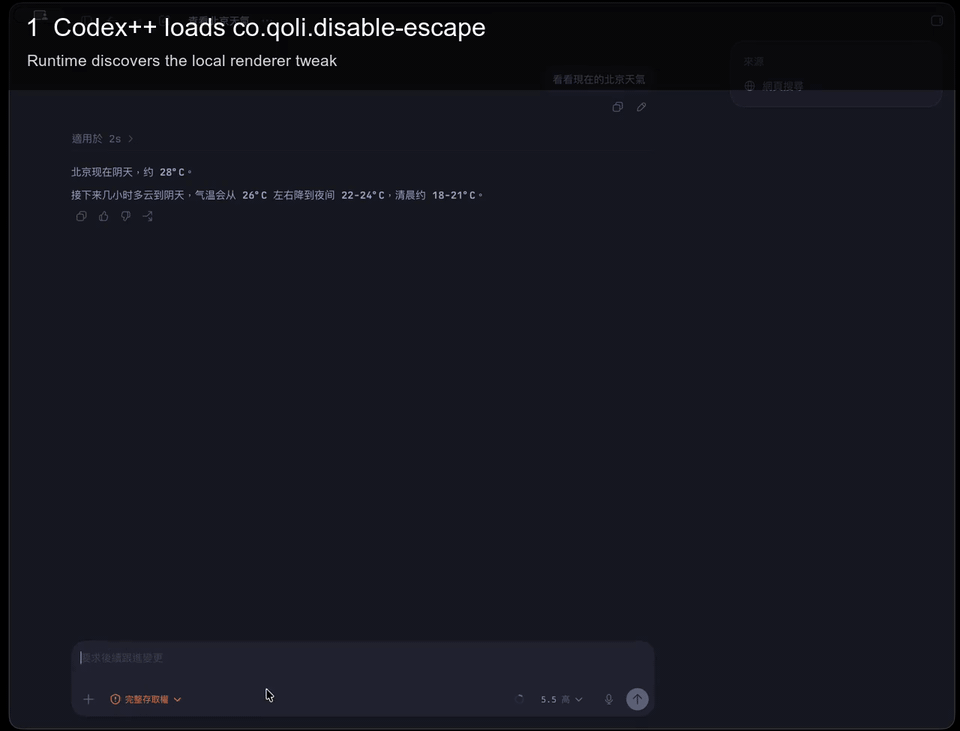

# Codex Disable Escape Tweak

A small [Codex++](https://github.com/b-nnett/codex-plusplus) renderer tweak
that consumes `Escape` key events inside Codex Desktop before the app's
shortcut handlers can interrupt an active response.



The demo is a cropped and annotated version of a Codex Desktop screen recording.
It shows the runtime path: Codex++ loads `co.qoli.disable-escape`, the tweak
registers capture-phase key handlers, and `Escape` is consumed before Codex
shortcut handling sees it.

Related upstream issue:

- [openai/codex#20767](https://github.com/openai/codex/issues/20767) -
  `Escape` from CJK IME composition can pass through and interrupt the model.

## What It Does

The tweak registers capture-phase `keydown`, `keyup`, and `keypress` handlers
on `window` and `document`. When `event.key === "Escape"`, it calls
`stopImmediatePropagation()` and `stopPropagation()`.

This only affects Codex Desktop renderer windows after Codex++ has loaded the
tweak. It does not change the global macOS `Escape` key behavior.

## Install

Install Codex++ first, then copy or symlink this repository into your Codex++
tweaks directory:

```bash
codexplusplus install --no-default-tweaks --no-watcher
codexplusplus dev /path/to/codex-disable-escape-tweak --name co.qoli.disable-escape --replace --no-watch
```

Restart Codex Desktop after installing or reloading the tweak.

## Verify

```bash
codexplusplus validate-tweak /path/to/codex-disable-escape-tweak
codexplusplus status
codexplusplus doctor
```

Codex++ ad-hoc signs the local app bundle after patching. `spctl` notarization
checks may reject the patched app even when `codexplusplus doctor` and
`codesign --verify` pass.
